  

<h1 align="center">Struttura — Social Buildings for Minecraft</h1>

  <b>Share your creations with the world. Discover buildings from other players. Generate them in your survival worlds.</b>

  
  
  
  
  

---

## What is Struttura?

**Struttura** is a Minecraft ecosystem that lets players **create**, **share**, and **discover** buildings across the community. Design your creations in-game, push them to the cloud, browse what others have built, and populate your survival worlds with player-made buildings — all without leaving Minecraft.

  

## The Mod — Two Editions

Struttura comes in **two mod variants**, both included in a single download:

### Architect

The **creative toolkit**. Use the **Construction Hammer** to select, edit, and manage your builds. Push your creations to the Struttura cloud, pull them back in other worlds, and browse the community catalog — all from an in-game GUI or via `/struttura` commands.

- Select areas and save buildings with metadata & rooms
- Define **randomized rooms** within a building — each spawn picks a different layout
- Push/pull creations to and from the Struttura cloud
- Browse, search, and like community buildings
- Manage your building library directly in-game

### Spawner

The **adventure engine**. As you explore your survival world, player-made buildings spawn naturally around you — turning every journey into a discovery. Stumble upon incredible creations from the community, explore them, and **like the ones you love** directly in-game. Your likes support the original builders and help the best creations rise to the top. Buildings can include **mobs** and **command blocks**, so creators can design full-blown adventures, traps, and interactive experiences for you to discover!

- Buildings appear as you explore new chunks — every adventure is unique
- Creations can contain mobs, entities, and command blocks for real adventures
- Discover and **like** community creations without leaving the game
- Smart placement engine: evaluates terrain, checks conditions, respects limits
- Fully configurable spawn radius, frequency, and buffer zones
- Choose which building collections appear in your world

---

## Download

| Platform | Link |
|:--------:|:----:|
| **GitHub Releases** | [Download from Releases](https://github.com/STRUTTURA/struttura-architect-spawner/releases) |
| **Modrinth** | [Download from Modrinth](https://modrinth.com/mod/struttura) |
| **CurseForge** | [Download from CurseForge](https://www.curseforge.com/minecraft/mc-mods/struttura) |
| **Struttura Website** | [struttura.magius.it](https://struttura.magius.it) |

### Requirements

- Minecraft **1.21.11**
- Fabric Loader **0.18.4+**
- Fabric API **0.140.2+**
- Java **21+**

---

## Screenshots

  
  

  
  

  

---

## Community & Support

### Discord

Join the **Struttura Discord** to chat with other builders, share your creations, suggest features, and get help:

**[Join our Discord Server](https://discord.gg/V26Adu6wcR)**

### Bug Reports

- **Mod issues** — Use the [Issues](https://github.com/STRUTTURA/struttura-architect-spawner/issues) tab on this repository
- **Website issues** — Report them on the [Issues](https://github.com/STRUTTURA/struttura-architect-spawner/issues) tab on this repository

### Support Us

- **PayPal** — [Donate via PayPal](https://www.paypal.com/pool/9mu3UFMhD3)
- **Patreon** — [Support on Patreon](https://www.patreon.com/cw/STRUTTURA)

---

## How It Works

```mermaid
flowchart LR
    A["🏗️ Build in Minecraft"] -->|"&nbsp; push &nbsp;"| B["☁️ Struttura Cloud"]
    B -->|"&nbsp; pull &nbsp;"| A
    C["🏗️ Other Players"] -->|"&nbsp; push &nbsp;"| B
    B -->|"&nbsp; pull &nbsp;"| C
    B -->|"&nbsp; browse &nbsp;"| D["🌐 Explore creations on<br>struttura.magius.it"]
    B -->|"&nbsp; spawn &nbsp;"| E["🎮 Discover & Like<br>buildings in your world"]
```

1. **Build** your creation in any Minecraft world
2. **Push** it to the Struttura cloud with the Construction Hammer
3. **Browse** community creations in-game or on the website
4. **Curate** lists of your favorite buildings
5. **Spawn** them in your survival world with the Spawner engine

---

  
   
  <i>Made with blocks and love.</i>
    
  <a href="https://struttura.magius.it">Website</a> · <a href="https://discord.gg/V26Adu6wcR">Discord</a> · <a href="https://modrinth.com/mod/struttura">Modrinth</a> · <a href="https://www.curseforge.com/minecraft/mc-mods/struttura">CurseForge</a>

